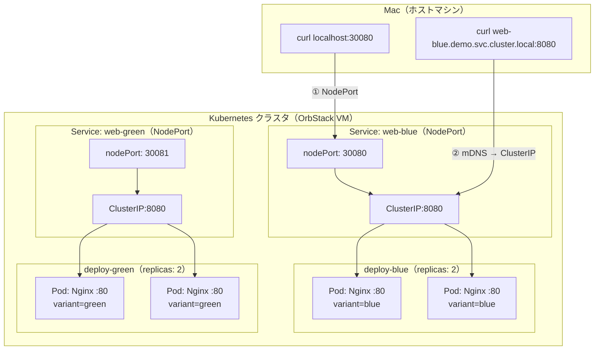

# Hello Kubernetes

1つの Docker イメージから2種類の Web サービスを起動するシンプルなKubernetesの事例です。

## 前提条件

- [OrbStack](https://orbstack.dev/) がインストール済み
- OrbStack の Kubernetes が有効（Settings → Kubernetes → Enable Kubernetes）

## プロジェクト構成

```
.
├── app/
│   ├── Dockerfile
│   ├── docker-entrypoint.sh   # 環境変数 VARIANT で配信する HTML を切り替え
│   ├── index-blue.html
│   └── index-green.html
├── k8s/
│   ├── kustomization.yaml
│   ├── namespace.yaml
│   ├── deployment-blue.yaml
│   ├── deployment-green.yaml
│   ├── service-blue.yaml      # web-blue Service（NodePort 30080）
│   └── service-green.yaml     # web-green Service（NodePort 30081）
└── README.md
```

## アーキテクチャ



| ポート | 誰が listen | 用途 |
|--------|------------|------|
| **30080 / 30081** (nodePort) | ノード | クラスタ外部からのアクセス入口 |
| **8080** (port) | Service の ClusterIP | クラスタ内部からのアクセス入口 |
| **80** (targetPort) | Pod 内の Nginx | 実際にリクエストを処理 |

## 手順

### 1. Docker イメージをビルド

```bash
docker build -t hello-k8s-web ./app
```

### 2. Kubernetes にデプロイ

`-k` で Kustomize で変換を行い、Kindベースのソート順で適用:

```bash
kubectl apply -k k8s/
```

`demo` Namespace が作成され、その中にリソースがデプロイされます。

```bash
kubectl get pods -n demo -w
```

### 3. 動作確認

**方法 A: NodePort でアクセス**

```bash
# Blue（ポート 30080）
curl http://localhost:30080

# Green（ポート 30081）
curl http://localhost:30081
```

**方法 B: OrbStack のドメインでアクセス（推奨）**

OrbStack では Service 名でアクセスできます。

```
<Service名>.<Namespace名>.svc.cluster.local
```

この方法は Service の ClusterIP に直接ルーティングされるため、Service の `port: 8080` を指定してアクセスします。

```bash
# Blue
curl http://web-blue.demo.svc.cluster.local:8080

# Green
curl http://web-green.demo.svc.cluster.local:8080
```

## ClusterIP

Service を作成すると、Kubernetes が **ClusterIP**（クラスタ内部でのみ有効な仮想 IP）を自動的に割り当てます。
ClusterIP はどのノードにも Pod にも紐づかず、一般的な Kubernetes では kube-proxy が iptables / IPVS ルールで実現しています。

> **注意:** OrbStack は kube-proxy を使用していません。独自の軽量ネットワークスタックが VM レベルで Service ルーティングを処理しています。

```console
% kubectl get svc -n demo
NAME        TYPE       CLUSTER-IP        EXTERNAL-IP   PORT(S)          AGE
web-blue    NodePort   192.168.194.174   <none>        8080:30080/TCP   7h3m
web-green   NodePort   192.168.194.156   <none>        8080:30081/TCP   7h3m
```

DNS 名 (`web-blue.demo.svc.cluster.local`) は、この ClusterIP に解決されます。

```bash
dscacheutil -q host -a name web-blue.demo.svc.cluster.local
```

`dig` コマンドでは解決できません。`.cluster.local` は `.local` で終わるため、macOS は mDNS（Bonjour）で名前解決を行います。OrbStack の VM が仮想ブリッジ上で mDNS レスポンダーとして応答することで解決が成立しています。これは Kubernetes の設計ではなく、OrbStack が macOS の mDNS の仕組みに乗っかった結果です。`dig` は mDNS を使わないため解決できません。mDNS 経由のシステムリゾルバを使う `dscacheutil` を使います。

通常、ClusterIP はクラスタ内部でのみ有効な仮想 IP であり、ホストマシンから直接アクセスすることはできません。
しかし OrbStack は Mac → クラスタネットワーク間のブリッジを透過的に提供しているため、あたかもローカルの IP のようにアクセスできます。

Mac のルーティングテーブルを確認すると、OrbStack が ClusterIP レンジへの経路を `bridge101`（仮想ブリッジ）経由で追加していることがわかります。

```bash
netstat -rn | grep 192.168.194
```

## Liveness / Readiness Probe

Kubernetes は Pod 内のコンテナが正常かどうかを **Probe（ヘルスチェック）** で監視します。

| Probe | 役割 | 失敗時の動作 |
|-------|------|-------------|
| **Liveness Probe** | コンテナが生きているか | コンテナを再起動 |
| **Readiness Probe** | リクエストを受け付けられるか | Service のエンドポイントから除外 |

本プロジェクトでは `httpGet` 方式で `/healthz` エンドポイントを監視しています。

```yaml
livenessProbe:
  httpGet:
    path: /healthz
    port: 80
  initialDelaySeconds: 3
  periodSeconds: 10
readinessProbe:
  httpGet:
    path: /healthz
    port: 80
  initialDelaySeconds: 1
  periodSeconds: 5
```

### Probe の動作を確認する

Pod の Probe 設定は `describe` で確認できます。

```bash
kubectl describe pod -n demo -l variant=blue | grep -A5 "Liveness\|Readiness"
```

Readiness Probe が失敗すると、Service の Endpoints から Pod が外れます。
Liveness Probe が失敗すると、kubelet がコンテナを再起動します。

## Kustomize

## セルフヒーリングを体験する

各 Deployment は `replicas: 2` で Pod を維持します。

まず、variant ラベルで Pod を確認します。

```bash
kubectl get pods -n demo -l variant=blue
kubectl get pods -n demo -l variant=green
```

Blue の Pod を1つ削除してみます。

```bash
kubectl delete pod -n demo -l variant=blue --field-selector=status.phase=Running --grace-period=0 | head -1
```

別ターミナルで監視すると、新しい Pod が即座に作成される様子を観察できます。

```bash
kubectl get pods -n demo -l variant=blue -w
```

全ての Pod を削除しても、Deployment が `replicas: 2` の状態に自動復旧します。

```bash
kubectl delete pods -n demo -l app=web
kubectl get pods -n demo -w
```

## クリーンアップ

Namespace を削除すると、中のリソースがすべて一括削除されます。

```bash
kubectl delete ns demo
```

マニフェストファイルを指定して削除する場合は以下でも可能です。

```bash
kubectl delete -k k8s/
```

## 参考

- [hello-k8s-logging](https://github.com/uraitakahito/hello-k8s-logging) — Kubernetes でのロギング構成
